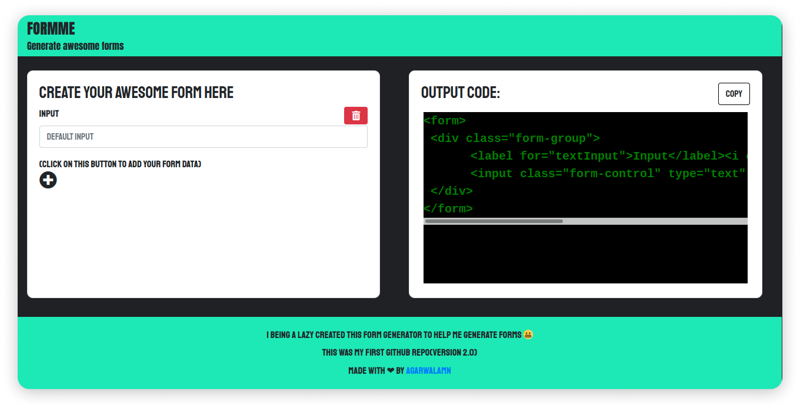

<h3>FORMME </h3>
  

    <b>Awesome form generator 👽</b>
  

   
  
   

### Link👨‍💻 :  https://agarwalamn.github.io/formme/

### Features ✨

**Create form with UI 🤠** : Generate bootstrap form simply from UI

**Made using JQuery 🤖**: Used JQuery for all the actions and stuff

**Awesome UI 🔄** : Not so much awesome but a decent UI

**Made during initial day of mu coding 🛃**

**Version** : 2.0

  <h3>
    Built with ❤️ by
      <a href="https://github.com/agarwalamn">agarwalamn</a>
    
  </h3>

